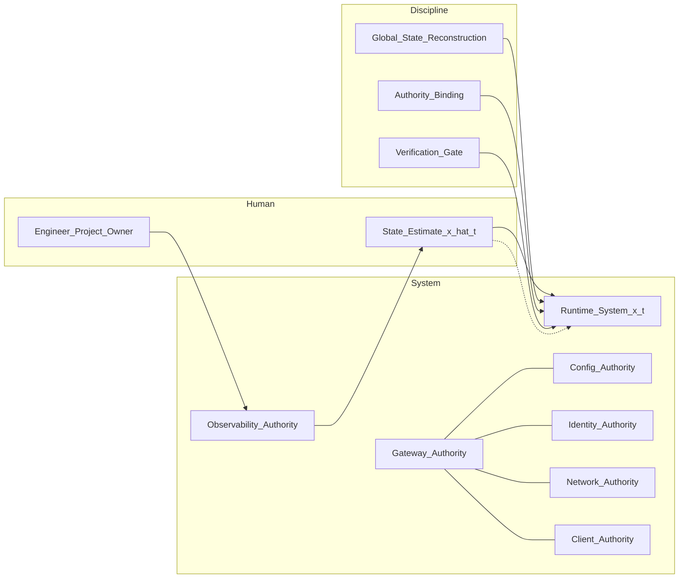
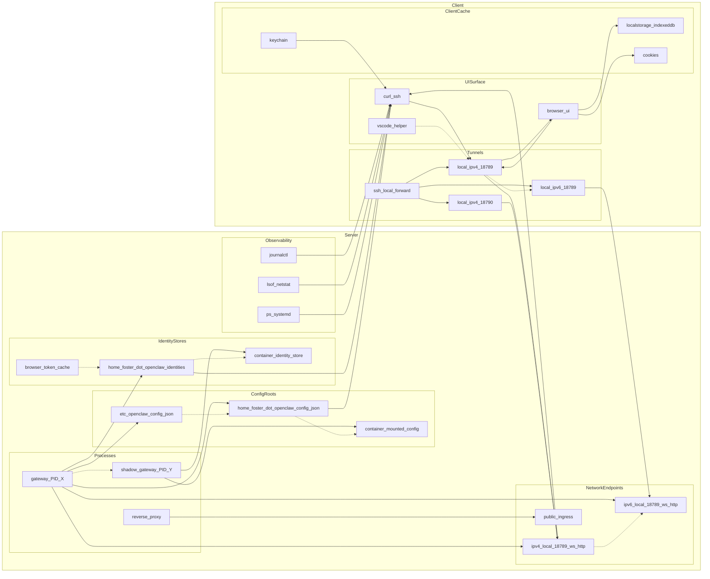

# VISCERAL — Global State Reconstruction & Authority Binding
**Date:** 2026-02-20 (America/New_York)

This document provides two Mermaid diagrams of the **runtime system graph** described in
“Global State Reconstruction, Authority Binding, and Systems Failure Modes”:

1. A **high-level** abstract topology diagram (roles + authority uniqueness).
2. A **nitty-gritty** runtime graph diagram (processes, configs, identity stores, sockets, tunnels, clients, caches) showing where split-brain and referential ambiguity appear.

---

## Diagram 1 — High-level (Abstract Roles & Authorities)

**Reading guide:**
- The system fails when the operator’s internal state model **x̂(t)** diverges from the real system **x(t)**, yet local checks continue to pass.
- The fix is not “debug a node”; it’s to **reconstruct the runtime graph**, then **bind authorities uniquely**.

---

## Diagram 2 — Nitty-gritty (Runtime Graph, Referents, and Split-Brain)

**Reading guide (nitty-gritty):**
- **Global State Reconstruction** means enumerating **exactly which nodes exist** (processes/configs/identity stores/sockets/tunnels/caches) and the **edges** (reads/listens/connects/validates).
- **Authority Binding** is the explicit act of selecting *one* referent per role:
  - *Gateway authority* = `openclaw-gateway (PID X)` (not “the gateway somewhere”)
  - *Config authority* = `/home/foster/.openclaw/config.json` (or whichever is proven loaded)
  - *Identity authority* = `/home/foster/.openclaw/identities/` (or whichever is proven used)
  - *Network authority* = `127.0.0.1:18789` (or whatever is proven reachable end-to-end)
- The **stable trap** is when multiple local checks are “green” while the *graph* is incoherent (split-brain, wrong referent, wrong tunnel, wrong cache).

---

## Minimal checklist (diagram-driven)
To exit “locally consistent / globally wrong,” bind these with evidence:

1. **Gateway authority** → exact PID + exact listener sockets.
2. **Config authority** → exact file path proven loaded by the gateway.
3. **Identity authority** → exact identity root path used for validation.
4. **Client path authority** → exact local listener → exact remote socket mapping.
5. **Client token authority** → exact token store (browser cache vs server) and its lifecycle.

End.
